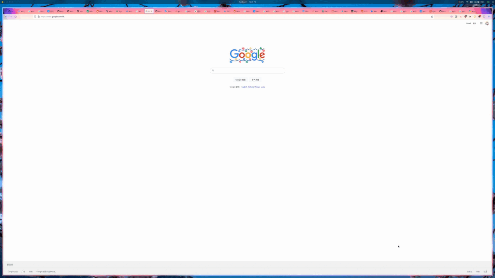

# sextans

> *It's a private configuration and an ongoing experiment while I use Archlinux.*

A simple drop down dashboard based on tmux. It includes following parts:

- Weather/Calendar
- Github Activity
- Audio Visualizer
- Volume Controller
- Hacker News
- CPU/Memory/Process Overview

### Dependency
- [cava](https://github.com/karlstav/cava)
- [tmuxinator](https://github.com/tmuxinator/tmuxinator)
- [ncpamixer](https://github.com/fulhax/ncpamixer)
- [hackernews-TUI](https://github.com/aome510/hackernews-TUI)
- [bottom](https://github.com/ClementTsang/bottom)
- A drop-down terminal.

### Install

Firstly install the above dependencies and then clone this project. Open `.tmuxinator.yml` and change the value of `root` section to your project path. Run `tmuxinator start` in a terminal that supports dropdown, e.g. `xfce4-terminal`.

### Screenshots

### License

BSD 3-Clause License
